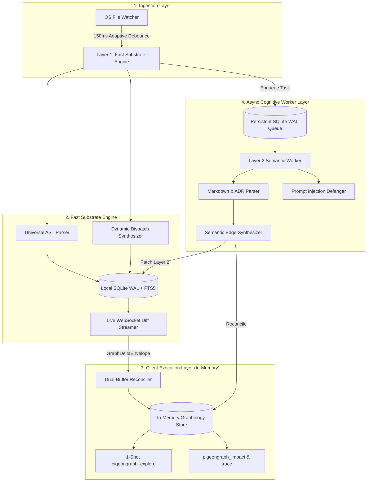

# 🐦 PigeonGraph

> **The Unified Multi-Layer Code Knowledge Graph for AI Coding Agents**  
> *Combines sub-second OS filesystem monitoring, dynamic dispatch synthesis, and asynchronous multimodal document intelligence into a zero-server architecture.*

[](LICENSE)
[](https://github.com/Hoppy-Beast/pigeongraph/actions)
[](https://nodejs.org)
[](https://modelcontextprotocol.io)

[](#-quickstart--installation)
[](#-quickstart--installation)
[](#-quickstart--installation)

[](#google-antigravity)
[](#claude-code--claude-desktop)
[](#cursor--windsurf)
[](#gemini-cli)
[](#github-copilot--vs-code)

**Author & Creator:** [MD. Mahinur Rahman Prachurza (Hoppy-Beast)](https://github.com/Hoppy-Beast)

---

## 📑 Contents

- [Why PigeonGraph?](#-why-pigeongraph)
- [Comparative Feature Matrix](#-comparative-feature-matrix)
- [Interactive 1-Shot Agent Experience](#-interactive-1-shot-agent-experience)
- [Architecture & Core Workflows](#-architecture--core-workflows)
- [Supported Languages & File Types](#-supported-languages--file-types)
- [Framework-Aware Routes & Dynamic Dispatch](#-framework-aware-routes--dynamic-dispatch)
- [Live Freshness & Dual-Buffer Sync](#-live-freshness--dual-buffer-sync)
- [Enterprise Security & Prompt Injection Defense](#-enterprise-security--prompt-injection-defense)
- [Quickstart & Installation](#-quickstart--installation)
- [Agent Setup & MCP Integration](#-agent-setup--mcp-integration)
- [CLI & Environment Reference](#-cli--environment-reference)
- [Monorepo Packages](#-monorepo-packages)
- [Troubleshooting & FAQ](#-troubleshooting--faq)
- [License & Attribution](#-license--attribution)

## 🚀 Why PigeonGraph?

When AI coding agents (Claude, Antigravity, Cursor, Gemini) work on large codebases, they waste **over 60% of their context window and time** blindly crawling files with `grep` and `find`.

Existing code graph systems embody fatal architectural compromises:
* **CodeGraph**: Blazing fast sub-second AST updates, but code-only (completely blind to architecture RFCs, ADRs, design specs, and media).
* **Graphify**: Broad multimodal document ingestion, but relies on static batch runs and lacks real-time sub-second OS file sync.
* **GitNexus**: Deep execution flows, but restricted by **non-commercial licensing (PolyForm 1.0)** and overwhelms LLMs with 17 granular tools.

**PigeonGraph synthesizes the best of all three while engineering away their flaws:**
1. **Sub-100ms Live Sync**: Native OS kernel watcher (`FSEvents` / `ReadDirectoryChangesW` / `inotify`) with adaptive debouncing (150ms–1500ms).
2. **Dynamic Dispatch Synthesis**: Resolves EventEmitters (`.emit` -> `.on`), Web framework routes (`GET /orders`), and React `setState` re-renders.
3. **Multimodal Knowledge Ingestion**: Connects code symbols directly to Markdown RFCs, Architecture Decision Records (ADRs), and `#WHY` design rationale tags.
4. **Triple-Hash Invariant State Machine**: Prevents race conditions between fast AST edits (<15ms) and slow background LLM document passes.
5. **1-Shot Agent MCP Paradigm**: AI agents get definitions, call hierarchies, dynamic dispatches, blast radius, and source spans in **1 single turn**.
6. **100% Permissive MIT License**: Freely forkable and usable in enterprise and commercial environments with standard attribution.

---

## 📊 Comparative Feature Matrix

| Feature / Capability | CodeGraph | Graphify | GitNexus | **PigeonGraph (Our Engine)** |
| :--- | :---: | :---: | :---: | :---: |
| **Licensing** | MIT (Permissive) | Apache 2.0 / MIT | **PolyForm Noncommercial (Commercial Ban)** | **MIT License (Permissive)** |
| **Index Freshness** | Native OS Watcher (100–2000ms) | Batch / Git Hooks (Manual) | Batch CLI (`gitnexus analyze`) | **Native OS Watcher + Adaptive Debounce** |
| **Multi-Modal Non-Code Docs (PDFs, ADRs, Specs)** | ❌ (Code only) | ✅ (PDFs, Whisper, Docs) | ❌ (Code & Markdown only) | ✅ (Markdown, RFCs, ADRs, Invariants) |
| **Dynamic Dispatch (EventEmitters, Routes, React)** | ✅ (Best-in-class) | ❌ (Raw name matching) | ⚠️ (MRO/DI only, misses events/React) | ✅ (EventEmitters + Routes + React + MRO) |
| **Execution Flow Tracing (`STEP_IN_PROCESS`)** | ❌ (On-the-fly search only) | ❌ (Clusters only) | ✅ (Scored entry-point BFS flows) | ✅ (Precomputed `STEP_IN_PROCESS` sequences) |
| **Agent MCP Experience** | ✅ **1-Tool Paradigm** (`explore`) | 7 MCP Tools | ❌ **17 MCP Tools (Tool Overload)** | ✅ **Tiered: 1 Primary (`explore`) + Analytical Opt-in** |
| **Cross-Repo Contract Registry** | ❌ (Single repo only) | ⚠️ (Global graph merge) | ✅ (Repository Groups & Contracts) | ✅ (Cross-Repo Contract Linkages) |
| **Client Memory Architecture** | SQLite DB file | NetworkX (High RAM ceiling) | Local Node backend (Server dependent) | **In-Memory Graphology + Zero-Server Mode** |
| **Prompt Injection Protection** | ❌ (None) | ⚠️ (Basic tags) | ❌ (None) | ✅ (Defanged sentinels + `<untrusted_source>`) |
| **Race Condition Safety (AST vs. LLM)** | N/A (AST only) | ❌ (Overwrites on rebuild) | ❌ (Sequential batch only) | ✅ (Triple-Hash Invariant State Machine) |

---

## ⚡ Interactive 1-Shot Agent Experience

Instead of forcing your agent into a 15-turn search loop opening dozen of files, PigeonGraph serves everything the model needs in **one single turn**:

```bash
$ pigeongraph explore "verifyToken"
```

```json
{
  "query_summary": {
    "query": "verifyToken",
    "resolved_anchor": "sg://core-backend/src/auth/jwt.ts#verifyToken",
    "epistemic_status": "EXACT",
    "total_graph_nodes_searched": 42,
    "duration_ms": 1.42
  },
  "symbols": [
    {
      "uid": "sg://core-backend/src/auth/jwt.ts#verifyToken",
      "name": "verifyToken",
      "kind": "function",
      "filePath": "src/auth/jwt.ts",
      "lineRange": [42, 78],
      "signature": "export async function verifyToken(token: string): Promise<UserSession>",
      "docstring": "Validates JWT token against active public keys.",
      "community": "Auth"
    }
  ],
  "execution_flows": {
    "entry_points": [
      {
        "type": "HTTP_ROUTE",
        "handler": "loginRoute"
      }
    ],
    "call_chains": [
      {
        "chain_id": "flow_verifyToken_01",
        "steps": [
          { "hop": 0, "symbol": "verifyToken", "action": "ORIGIN" },
          { "hop": 1, "symbol": "getKey", "action": "CALLS" }
        ]
      }
    ]
  },
  "dynamic_dispatches": [
    {
      "pattern": "DYNAMIC_DISPATCH_EVENT",
      "emitter": "sg://core-backend/src/auth/jwt.ts#verifyToken",
      "listener": "auditLogger.on('auth:success')",
      "confidence": 0.85
    }
  ],
  "blast_radius": {
    "risk_level": "HIGH",
    "risk_score": 0.65,
    "affected_files_count": 3,
    "affected_symbols_count": 5,
    "critical_breakages": ["loginRoute", "verifyToken", "getKey"]
  },
  "served_spans": [
    {
      "filePath": "src/auth/jwt.ts",
      "ranges": [[42, 78]],
      "content": "export async function verifyToken(token: string): Promise<UserSession> {\n  const key = await getKey();\n  return jwt.verify(token, key);\n}",
      "token_count": 34
    }
  ]
}
```

---

## 🏗️ Architecture & Core Workflows



---

## 🌐 Supported Languages & File Types

PigeonGraph delivers zero-configuration parsing and relationship extraction across all primary enterprise languages:

| Language / Format | File Extensions | Extracted Entities & Parser Architecture |
| :--- | :--- | :--- |
| **TypeScript / JavaScript** | `.ts`, `.tsx`, `.js`, `.jsx`, `.mjs`, `.cjs` | Dedicated AST: Classes, functions, methods, interfaces, imports, calls, extends, implements, exported symbols |
| **Python** | `.py`, `.pyi` | Dedicated AST: Classes, async/sync functions, decorators, methods, module imports, inheritance hierarchies |
| **Rust / Go / Java / C / C++** | `.rs`, `.go`, `.java`, `.c`, `.cpp`, `.h` | Generic Substrate: High-throughput function & procedure extraction (`fn`, `func`, `function`, `def`), signatures, file containment |
| **Architecture Specs & ADRs** | `.md`, `.markdown`, `.txt` | Semantic Layer: RFCs, ADR status (`ACCEPTED`, `DEPRECATED`), invariants, `REQ-*` requirements, `#WHY:` design rationales |

---

## 🔀 Framework-Aware Routes & Dynamic Dispatch

Static text search fails when calls happen indirectly through routers or event buses. PigeonGraph synthesizes these runtime hops into concrete graph edges:

| Boundary / System | Source Expression | Synthesized Edge Target | Edge Kind & Dispatch Mechanism |
| :--- | :--- | :--- | :--- |
| **Express / Node HTTP** | `app.get('/api/orders', listOrders)` | `function listOrders(req, res)` | `HANDLES_ROUTE` (`HTTP GET /api/orders`) |
| **Express / Koa / Router** | `router.post('/checkout', checkoutHandler)` | `function checkoutHandler(req, res)` | `HANDLES_ROUTE` (`HTTP POST /checkout`) |
| **Node.js EventEmitter** | `emitter.emit('order:created', data)` | `emitter.on('order:created', handler)` | `DYNAMIC_DISPATCH_EVENT` (`event_emitter.on(order:created)`) |
| **React State Cascades** | `setState(...)` / `setCount(...)` | Dependent component re-render flow | `DYNAMIC_DISPATCH_REACT_STATE` (`react_state_rerender`) |
| **Markdown ADR Specs** | `REQ-AUTH-01: verifyToken must check keys` | `function verifyToken(...)` | `IMPLEMENTS_SPEC` (`REQ-AUTH-01`) |
| **Architecture Invariants** | `#WHY: Prevent double billing on retry` | `PaymentProcessor.charge()` | `JUSTIFIED_BY_ADR` (`ADR-005`) |

---

## ⏱️ Live Freshness & Dual-Buffer Sync

Never re-index manually. PigeonGraph coordinates three synchronized layers to maintain constant graph freshness:

1. **Adaptive Kernel File Watcher**:
   - Uses native OS event APIs (`ReadDirectoryChangesW` on Windows, `FSEvents` on macOS, `inotify` on Linux).
   - **Adaptive Debounce**: Uses a 150ms quiet window for single-file saves, and dynamically widens to 1500ms during rapid burst edits (e.g., git branch checkout or large refactorings) to eliminate churn.

2. **WebSocket Mutation Diff Streamer**:
   - Background streaming engine running over `ws://127.0.0.1:5051`.
   - Broadcasts atomic `GraphDeltaEnvelope` frames containing discrete `NodeUpsert`, `NodeDelete`, and `EdgeUpsert` records.

3. **Dual-Buffer Client Reconciler**:
   - Staged mutations are validated in an off-screen buffer.
   - Pointers swap atomically into the hot in-memory Graphology store without UI flashing, dropped frames, or blocking agent queries.

---

## 🛡️ Enterprise Security & Prompt Injection Defense

PigeonGraph is built from the ground up for strict enterprise data privacy and security:

* **100% Local Processing**: No source code, metadata, or documentation is ever transmitted over the network. Zero external API keys are required for code graph construction.
* **Zero Telemetry**: No background telemetry, usage tracking, or behavioral profiling.
* **Prompt Injection Defanger (`PromptDefanger`)**:
  - Codebases frequently ingest untrusted third-party Markdown files, issues, or user documentation containing malicious LLM jailbreak sequences.
  - PigeonGraph neutralizes LLM injection sentinels (including `<|im_start|>`, `<|im_end|>`, `<<SYS>>`, `[INST]`) by inserting zero-width spaces (`\u200b`).
  - Encapsulates untrusted documentation in explicit XML sandbox boundaries:
    ```xml
    <untrusted_source path="docs/untrusted.md" sha256="4a3b...c9d0">
      ... sanitized document content ...
    </untrusted_source>
    ```

---

## ⚡ Quickstart & Installation

### 1. Prerequisites
- **Node.js >= 22.5.0** (Node 24 recommended, required for zero-dependency native `node:sqlite`)
- **npm >= 10.0.0**

### 2. Clone & Build

```bash
# Clone repository
git clone https://github.com/Hoppy-Beast/pigeongraph.git
cd pigeongraph

# Install dependencies and compile monorepo
npm install
npm run build
```

### 3. Run Test Suite

Verify all 19 unit & integration tests pass:

```bash
npm test
```

### 4. Direct CLI Exploration

Explore any codebase symbol directly from your terminal:

```bash
npx pigeongraph explore "verifyToken"
```

---

## 🔌 Agent Setup & MCP Integration

PigeonGraph natively implements the **Model Context Protocol (MCP)** (2024-11-05 spec) over `stdio`.

### Google Antigravity
Add to your project's `.gemini/antigravity/mcp/pigeongraph.json` or `.gemini/antigravity/mcp_config.json`:

```json
{
  "mcpServers": {
    "pigeongraph": {
      "command": "node",
      "args": [
        "path/to/PigeonGraph/packages/pigeongraph-mcp/dist/cli.js",
        "serve-mcp"
      ]
    }
  }
}
```

### Claude Code / Claude Desktop
Add to `claude_desktop_config.json` or `~/.claude.json`:

```json
{
  "mcpServers": {
    "pigeongraph": {
      "command": "node",
      "args": [
        "path/to/PigeonGraph/packages/pigeongraph-mcp/dist/cli.js",
        "serve-mcp"
      ]
    }
  }
}
```

#### Auto-Allow Permissions for Claude Code
Add to `~/.claude/settings.json` so Claude Code executes queries seamlessly without manual permission prompts:

```json
{
  "permissions": {
    "allow": [
      "mcp__pigeongraph__*"
    ]
  }
}
```

### Cursor / Windsurf
Add to `.cursor/mcp.json`:

```json
{
  "mcpServers": {
    "pigeongraph": {
      "command": "node",
      "args": [
        "path/to/PigeonGraph/packages/pigeongraph-mcp/dist/cli.js",
        "serve-mcp"
      ]
    }
  }
}
```

### Gemini CLI
Add to `~/.gemini/settings.json`:

```json
{
  "mcpServers": {
    "pigeongraph": {
      "command": "node",
      "args": [
        "path/to/PigeonGraph/packages/pigeongraph-mcp/dist/cli.js",
        "serve-mcp"
      ]
    }
  }
}
```

### GitHub Copilot / VS Code
Add to `.vscode/settings.json`:

```json
{
  "github.copilot.chat.mcpServers": {
    "pigeongraph": {
      "command": "node",
      "args": [
        "path/to/PigeonGraph/packages/pigeongraph-mcp/dist/cli.js",
        "serve-mcp"
      ]
    }
  }
}
```

### Steering Your Agents (`AGENTS.md` / `CLAUDE.md` / `GEMINI.md`)
Add this section to your project's root `AGENTS.md`, `CLAUDE.md`, or `GEMINI.md` to guide agents to use the graph instead of crawling files:

```markdown
<!-- pigeongraph-guidance -->
## Architectural Exploration with PigeonGraph
Before crawling files with grep/find, ALWAYS query PigeonGraph first:
- Use `pigeongraph_explore` (MCP) or `pigeongraph explore "<query>"` (CLI).
- It provides definitions, line ranges, dynamic dispatches, and blast radius in 1 turn.
<!-- /pigeongraph-guidance -->
```

---

## 🛠️ MCP Tools Overview

### 1. `pigeongraph_explore` (Primary 1-Shot Tool)
Answers architectural queries in **1 single turn**, returning:
* **`symbols`**: Exact definitions, line ranges, signatures, and docstrings.
* **`execution_flows`**: Entry points (`HTTP_ROUTE`, `CLI_COMMAND`) and call chains.
* **`dynamic_dispatches`**: Synthesized EventEmitter channels, route handlers, and React state.
* **`blast_radius`**: Risk-weighted impact analysis (`LOW`, `MEDIUM`, `HIGH`, `CRITICAL`).
* **`served_spans`**: Deduplicated source code spans.

### 2. `pigeongraph_impact`
Calculates precise blast radius and risk severity scores across upstream/downstream callers.

### 3. `pigeongraph_trace`
Traces the shortest directed execution path between two symbols across modules and repositories.

---

## 💻 CLI & Environment Reference

### Commands

| Command | Description |
| :--- | :--- |
| `pigeongraph serve-mcp` | Starts stdio JSON-RPC 2.0 Model Context Protocol (MCP) server |
| `pigeongraph explore <query>` | Answers architectural query in 1 shot, printing JSON result to stdout |
| `pigeongraph help` | Displays CLI version and available command flags |

### Environment Variables

| Variable | Default | Purpose |
| :--- | :--- | :--- |
| `PIGEONGRAPH_WS_PORT` | `5051` | Local port for the live WebSocket mutation diff broadcaster |
| `PIGEONGRAPH_DB_PATH` | `:memory:` | SQLite database location (`:memory:` for zero-disk mode, or file path) |
| `PIGEONGRAPH_LONE_DEBOUNCE_MS` | `150` | File watcher debounce window for isolated single-file saves (ms) |
| `PIGEONGRAPH_BURST_DEBOUNCE_MS` | `1500` | File watcher debounce window for rapid burst edits / branch switches (ms) |

---

## 📦 Monorepo Packages

| Package | Purpose & Technologies |
| :--- | :--- |
| **[`@pigeongraph/schema`](packages/pigeongraph-schema)** | Draft 2020-12 formal schema, Lamport/Vector clocks, invariant hashes (`H_content`, `H_ast`, `H_semantic_inv`) |
| **[`@pigeongraph/substrate`](packages/pigeongraph-substrate)** | Sub-100ms universal AST parser, dynamic synthesizers, Node 24 native SQLite WAL + FTS5, WS streamer |
| **[`@pigeongraph/semantic`](packages/pigeongraph-semantic)** | 4-tier persistent SQLite queue, prompt injection defanger sandbox, Markdown/ADR synthesizer |
| **[`@pigeongraph/client`](packages/pigeongraph-client)** | Hot in-memory Graphology store, dual-buffer reconciler, 1-shot `pigeongraph_explore` engine |
| **[`@pigeongraph/mcp`](packages/pigeongraph-mcp)** | Stdio JSON-RPC 2.0 MCP server and unified CLI (`pigeongraph`) |

---

## ❓ Troubleshooting & FAQ

**Q: Why does PigeonGraph require Node.js >= 22.5.0?**  
A: PigeonGraph is engineered as a **zero-external-dependency** code graph. It utilizes Node.js's native `node:sqlite` (`DatabaseSync`) module with built-in WAL and FTS5, introduced in Node.js v22.5.0. This eliminates the need for third-party C++ compilation toolchains (node-gyp, python, make).

**Q: `pigeongraph: command not found` in terminal?**  
A: If running locally without global installation, invoke with `npx pigeongraph` or point directly to the built CLI binary: `node packages/pigeongraph-mcp/dist/cli.js explore <query>`.

**Q: Leading slash issue in Windows PowerShell?**  
A: In PowerShell, avoid typing `/pigeongraph` (leading `/` is treated as a root directory path separator). Use `pigeongraph explore ...` or `npx pigeongraph explore ...`.

**Q: Can I run multiple agents against PigeonGraph simultaneously?**  
A: Yes. The in-memory Graphology store and Substrate SQLite WAL support concurrent read queries without database lock contention.

---

## 📜 License & Attribution

This project is licensed under the **MIT License** — see the [LICENSE](LICENSE) file for details.

**Copyright (c) 2026 MD. Mahinur Rahman Prachurza (Hoppy-Beast)**
