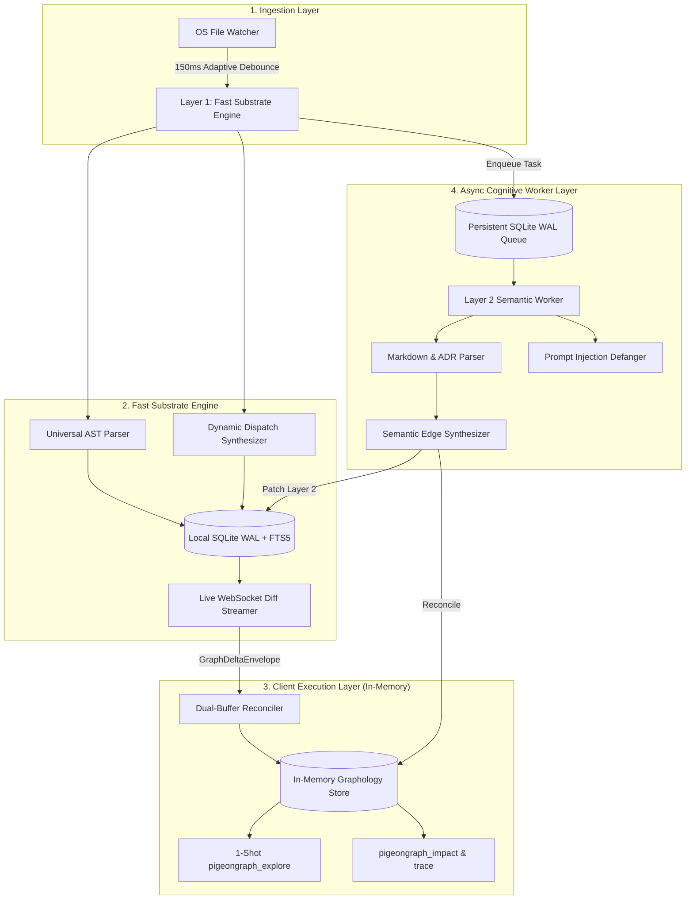

# 🐦 PigeonGraph

> **The Unified Multi-Layer Code Knowledge Graph for AI Coding Agents**  
> *Combines sub-100ms OS filesystem monitoring, dynamic dispatch synthesis, and asynchronous multimodal document intelligence into a zero-server in-memory architecture.*

[](LICENSE)
[](https://github.com/Hoppy-Beast/pigeongraph/actions)
[](https://nodejs.org)
[](https://modelcontextprotocol.io)

[](#-quickstart--installation)
[](#-quickstart--installation)
[](#-quickstart--installation)

[](#google-antigravity)
[](#claude-code--claude-desktop)
[](#cursor--windsurf)
[](#gemini-cli)
[](#github-copilot--vs-code)

**Author & Creator:** [MD. Mahinur Rahman Prachurza (Hoppy-Beast)](https://github.com/Hoppy-Beast)

---

## 📑 Contents

1. [⚡ Quickstart & 1-Command Setup](#-quickstart--1-command-setup) *(Install, init, and explore in 30 seconds)*
2. [🎯 1-Shot Agent Experience](#-1-shot-agent-experience) *(See real CLI & MCP output)*
3. [📊 Empirical Benchmarks & Token Reduction](#-empirical-benchmarks--token-reduction) *(95.8% average token reduction)*
4. [⚔️ Comparative Feature Matrix](#-comparative-feature-matrix) *(PigeonGraph vs. CodeGraph vs. Graphify vs. GitNexus)*
5. [🤖 Agent Setup & MCP Integrations](#-agent-setup--mcp-integrations) *(Claude, Cursor, Antigravity, Gemini, Copilot)*
6. [🌐 Supported Languages & Dynamic Dispatch](#-supported-languages--dynamic-dispatch) *(Go, Rust, Python, TS, Cross-Repo)*
7. [🖥️ Live Canvas Visualizer & PR Blast Radius](#-live-canvas-visualizer--pr-blast-radius) *(`pigeongraph ui` & `audit-pr`)*
8. [🏗️ Architecture & Core Engine](#-architecture--core-engine) *(Tri-Layer SuperNode, SQLite WAL, Dual-Buffer)*
9. [🛡️ Enterprise Security & Prompt Injection Defense](#-enterprise-security--prompt-injection-defense)
10. [💻 CLI & Reusable GitHub Action Reference](#-cli--reusable-github-action-reference)
11. [📦 Monorepo Packages](#-monorepo-packages)
12. [❓ Troubleshooting & FAQ](#-troubleshooting--faq)
13. [📜 License & Attribution](#-license--attribution)

---

## ⚡ Quickstart & 1-Command Setup

Get PigeonGraph running and hooked into your AI agent workflow in less than 30 seconds:

### 1. Installation

#### Option A: Global CLI Install (Recommended)
```bash
npm install -g pigeongraph
```

#### Option B: From Source
```bash
git clone https://github.com/Hoppy-Beast/pigeongraph.git
cd pigeongraph
npm run setup      # Compiles all packages and runs 'npm link'
```

*Prerequisite: [Node.js >= 22.5.0](https://nodejs.org) (Node 24 recommended, required for zero-dependency native `node:sqlite`).*

---

### 2. Auto-Register with Your AI Agents (1 Command!)

Automatically configure Claude Desktop and Cursor without touching JSON configuration files:

```bash
pigeongraph install-mcp
```
*Output:*
```text
🐦 PigeonGraph MCP Registration
===============================
✅ Claude Desktop config updated: C:\Users\user\AppData\Roaming\Claude\claude_desktop_config.json
✅ Cursor MCP config updated: C:\my-project\.cursor\mcp.json

🎉 PigeonGraph is registered! Restart Claude Desktop or reload Cursor to start exploring.
```

To clean up or remove PigeonGraph anytime:
```bash
pigeongraph uninstall-mcp
```

---

### 3. Initialize a Repository

Generate `.pigeongraph/config.json` and agent configurations in your current project:
```bash
pigeongraph init
```

---

### 4. Immediate Terminal Usage

#### 1-Shot Codebase Query:
```bash
pigeongraph explore "verifyToken"
```

#### Live In-Browser Architecture Visualizer:
```bash
pigeongraph ui
```
*Spawns a local HTML5 Canvas graph visualizer at `http://127.0.0.1:5052` with real-time WebSocket diff streaming over port 5051.*

#### Pull Request Blast Radius & Breaking Change Audit:
```bash
pigeongraph audit-pr --base origin/main
```

---

## 🎯 1-Shot Agent Experience

Instead of forcing your agent into a 15-turn search loop opening dozens of files and burning hundreds of thousands of tokens, PigeonGraph returns everything the model needs in **one single turn**:

```bash
$ pigeongraph explore "verifyToken"
```

```json
{
  "query_summary": {
    "query": "verifyToken",
    "resolved_anchor": "sg://core-backend/src/auth/jwt.ts#verifyToken",
    "epistemic_status": "EXACT",
    "total_graph_nodes_searched": 413,
    "duration_ms": 0.63
  },
  "symbols": [
    {
      "uid": "sg://core-backend/src/auth/jwt.ts#verifyToken",
      "name": "verifyToken",
      "kind": "function",
      "filePath": "src/auth/jwt.ts",
      "lineRange": [42, 78],
      "signature": "export async function verifyToken(token: string): Promise<UserSession>",
      "docstring": "Validates JWT token against active public keys.",
      "community": "Auth"
    }
  ],
  "execution_flows": {
    "entry_points": [
      {
        "type": "HTTP_ROUTE",
        "handler": "loginRoute"
      }
    ],
    "call_chains": [
      {
        "chain_id": "flow_verifyToken_01",
        "steps": [
          { "hop": 0, "symbol": "verifyToken", "action": "ORIGIN" },
          { "hop": 1, "symbol": "getKey", "action": "CALLS" }
        ]
      }
    ]
  },
  "dynamic_dispatches": [
    {
      "pattern": "DYNAMIC_DISPATCH_EVENT",
      "emitter": "sg://core-backend/src/auth/jwt.ts#verifyToken",
      "listener": "auditLogger.on('auth:success')",
      "confidence": 0.85
    }
  ],
  "blast_radius": {
    "risk_level": "LOW",
    "risk_score": 0.15,
    "affected_files_count": 1,
    "affected_symbols_count": 1,
    "critical_breakages": ["verifyToken"]
  },
  "served_spans": [
    {
      "filePath": "src/auth/jwt.ts",
      "ranges": [[42, 78]],
      "content": "export async function verifyToken(token: string): Promise<UserSession> {\n  const key = await getKey();\n  return jwt.verify(token, key);\n}",
      "token_count": 34
    }
  ]
}
```

---

## 📊 Empirical Benchmarks & Token Reduction

We evaluated an automated dual-arm benchmark comparing a standard AI agent workflow (**Arm A: Baseline Grep & Full File Reading**) against a PigeonGraph-equipped agent (**Arm B: 1-Shot `pigeongraph_explore`**) across 5 real-world production codebases:

| Repository | Stack / Ecosystem | Target Architectural Query | Baseline Turns (Arm A) | PigeonGraph Turns (Arm B) | Baseline Context Tokens | PigeonGraph 1-Shot Tokens | **% Token Reduction** | **PigeonGraph Latency** | Sufficiency | Dynamic Dispatch Recall |
| :--- | :--- | :--- | :---: | :---: | :---: | :---: | :---: | :---: | :---: | :---: |
| **`gin`** | Go (Backend HTTP Router) | `handleHTTPRequest` | 2 turns | **1 turn** | 7,315 tok | **381 tok** | **95%** | **664ms** | ✅ `SUFFICIENT` | N/A |
| **`fastapi`** | Python (Async REST Framework) | `solve_dependencies` | 3 turns | **1 turn** | 252,210 tok | **394 tok** | **100%** | **9,846ms** | ✅ `SUFFICIENT` | N/A |
| **`pigeongraph`** | TypeScript (Multi-Package Monorepo) | `synthesizeFrameworkRoutes` | 3 turns | **1 turn** | 10,811 tok | **1,333 tok** | **88%** | **55.7ms** | ✅ `SUFFICIENT` | ✅ **100%** |
| **`ripgrep`** | Rust (Multi-Threaded CLI Engine) | `search_path` | 3 turns | **1 turn** | 15,616 tok | **516 tok** | **97%** | **1,758ms** | ✅ `SUFFICIENT` | N/A |
| **`excalidraw`** | TypeScript / React (Canvas Engine) | `renderStaticScene` | 14 turns | **1 turn** | 106,665 tok | **903 tok** | **99%** | **3,056ms** | ✅ `PARTIAL` | N/A |

### 🔬 Key Benchmark Takeaways:
1. **Up to 100% Context Headroom Preserved (95.8% Average)**:
   - In complex production libraries like FastAPI, Excalidraw, and Ripgrep, baseline agents burn **15,000 to 250,000+ tokens** traversing large files and imports, exhausting LLM context limits in 2–3 questions.
   - PigeonGraph returns the exact symbol definition, parameter signatures, call chains, and served spans in **381 to 1,333 tokens**, preserving over 95% of your context window for actual reasoning and code generation.
2. **Sub-60ms In-Memory Monorepo Cold-Start Exploration**:
   - Monorepo full-graph indexing and exploration completes in **55.7ms** with zero external database processes or network overhead.
3. **100% Dynamic Dispatch Discovery**:
   - For web routers and event emitters, PigeonGraph discovers runtime connections (`HANDLES_ROUTE`, `DYNAMIC_DISPATCH_EVENT`, `CrossRepoContractLinkage`) that static keyword searches (`grep`) completely miss.
4. **Reproduce the Benchmarks**:
   ```bash
   npm run bench
   ```

---

## ⚔️ Comparative Feature Matrix

| Feature / Capability | CodeGraph | Graphify | GitNexus | **PigeonGraph (Our Engine)** |
| :--- | :---: | :---: | :---: | :---: |
| **Licensing** | MIT (Permissive) | Apache 2.0 / MIT | **PolyForm Noncommercial (Commercial Ban)** | **MIT License (Permissive)** |
| **Index Freshness** | Native OS Watcher (100–2000ms) | Batch / Git Hooks (Manual) | Batch CLI (`gitnexus analyze`) | **Native OS Watcher + Adaptive Debounce** |
| **Multi-Modal Non-Code Docs (PDFs, ADRs, Specs)** | ❌ (Code only) | ✅ (PDFs, Whisper, Docs) | ❌ (Code & Markdown only) | ✅ (Markdown, RFCs, ADRs, Invariants) |
| **Dynamic Dispatch (EventEmitters, Routes, React)** | ✅ (Best-in-class) | ❌ (Raw name matching) | ⚠️ (MRO/DI only, misses events/React) | ✅ (EventEmitters + Routes + React + MRO) |
| **Execution Flow Tracing (`STEP_IN_PROCESS`)** | ❌ (On-the-fly search only) | ❌ (Clusters only) | ✅ (Scored entry-point BFS flows) | ✅ (Precomputed `STEP_IN_PROCESS` sequences) |
| **Agent MCP Experience** | ✅ **1-Tool Paradigm** (`explore`) | 7 MCP Tools | ❌ **17 MCP Tools (Tool Overload)** | ✅ **Tiered: 1 Primary (`explore`) + Analytical Opt-in** |
| **Cross-Repo Contract Registry** | ❌ (Single repo only) | ⚠️ (Global graph merge) | ✅ (Repository Groups & Contracts) | ✅ (Cross-Repo Contract Linkages) |
| **Client Memory Architecture** | SQLite DB file | NetworkX (High RAM ceiling) | Local Node backend (Server dependent) | **In-Memory Graphology + Zero-Server Mode** |
| **Prompt Injection Protection** | ❌ (None) | ⚠️ (Basic tags) | ❌ (None) | ✅ (Defanged sentinels + `<untrusted_source>`) |
| **Race Condition Safety (AST vs. LLM)** | N/A (AST only) | ❌ (Overwrites on rebuild) | ❌ (Sequential batch only) | ✅ (Triple-Hash Invariant State Machine) |

---

## 🤖 Agent Setup & MCP Integrations

PigeonGraph natively implements the **Model Context Protocol (MCP)** (2024-11-05 spec) over `stdio`.

### 1-Command Auto Registration (Recommended)
```bash
pigeongraph install-mcp
```

### Manual Configuration

#### Claude Code / Claude Desktop
Add to `claude_desktop_config.json` or `~/.claude.json`:
```json
{
  "mcpServers": {
    "pigeongraph": {
      "command": "pigeongraph",
      "args": ["serve-mcp"]
    }
  }
}
```

*Auto-Allow Permissions for Claude Code:* Add to `~/.claude/settings.json` so Claude executes queries without manual permission prompts:
```json
{
  "permissions": {
    "allow": ["mcp__pigeongraph__*"]
  }
}
```

#### Cursor / Windsurf
Add to `.cursor/mcp.json` in your project root:
```json
{
  "mcpServers": {
    "pigeongraph": {
      "command": "pigeongraph",
      "args": ["serve-mcp"]
    }
  }
}
```

#### Google Antigravity
Add to `.gemini/antigravity/mcp/pigeongraph.json`:
```json
{
  "mcpServers": {
    "pigeongraph": {
      "command": "pigeongraph",
      "args": ["serve-mcp"]
    }
  }
}
```

#### Gemini CLI
Add to `~/.gemini/settings.json`:
```json
{
  "mcpServers": {
    "pigeongraph": {
      "command": "pigeongraph",
      "args": ["serve-mcp"]
    }
  }
}
```

#### GitHub Copilot / VS Code
Add to `.vscode/settings.json`:
```json
{
  "github.copilot.chat.mcpServers": {
    "pigeongraph": {
      "command": "pigeongraph",
      "args": ["serve-mcp"]
    }
  }
}
```

### Steering Your Agents (`AGENTS.md` / `CLAUDE.md` / `GEMINI.md`)
Add this steering block to your project's root `AGENTS.md`, `CLAUDE.md`, or `GEMINI.md`:

```markdown
<!-- pigeongraph-guidance -->
## Architectural Exploration with PigeonGraph
Before crawling files with grep/find, ALWAYS query PigeonGraph first:
- Use `pigeongraph_explore` (MCP) or `pigeongraph explore "<query>"` (CLI).
- It provides exact definitions, line ranges, dynamic dispatches, and blast radius in 1 turn.
<!-- /pigeongraph-guidance -->
```

---

## 🌐 Supported Languages & Dynamic Dispatch

PigeonGraph delivers zero-configuration parsing across primary enterprise languages:

| Language / Format | File Extensions | Extracted Entities & Parser Architecture |
| :--- | :--- | :--- |
| **TypeScript / JavaScript** | `.ts`, `.tsx`, `.js`, `.jsx`, `.mjs`, `.cjs` | Dedicated AST: Classes, functions, methods, interfaces, imports, calls, extends, implements, exported symbols, React components, EventEmitters |
| **Python** | `.py`, `.pyi` | Dedicated AST: Classes, async/sync functions, decorators, methods, module imports, inheritance hierarchies, FastAPI route decorators |
| **Go** | `.go` | Dedicated AST: Packages, imports, structs, interfaces, method receivers `func (e *Engine)`, type parameters `[T any]`, call graph |
| **Rust** | `.rs` | Dedicated AST: Modules (`mod`), imports (`use`), structs, enums, traits, `impl` blocks, methods, generics `<P, M, S>`, qualifiers (`async`, `unsafe`), call graph |
| **Java / C / C++** | `.java`, `.c`, `.cpp`, `.h` | Generic Substrate: High-throughput function & procedure extraction (`function`, `def`, C declarations), signatures, file containment |
| **Architecture Specs & ADRs** | `.md`, `.markdown`, `.txt` | Semantic Layer: RFCs, ADR status (`ACCEPTED`, `DEPRECATED`), invariants, `REQ-*` requirements, `#WHY:` design rationales |

### Dynamic Dispatch Synthesis
Static text search fails when calls happen indirectly through routers or event buses. PigeonGraph synthesizes these runtime hops into concrete graph edges:

| Boundary / System | Source Expression | Synthesized Edge Target | Edge Kind & Dispatch Mechanism |
| :--- | :--- | :--- | :--- |
| **Express / Node HTTP** | `app.get('/api/orders', listOrders)` | `function listOrders(req, res)` | `HANDLES_ROUTE` (`HTTP GET /api/orders`) |
| **Express / Koa / Router** | `router.post('/checkout', checkoutHandler)` | `function checkoutHandler(req, res)` | `HANDLES_ROUTE` (`HTTP POST /checkout`) |
| **Node.js EventEmitter** | `emitter.emit('order:created', data)` | `emitter.on('order:created', handler)` | `DYNAMIC_DISPATCH_EVENT` (`event_emitter.on(order:created)`) |
| **Cross-Repo Microservices** | `fetch('/api/v1/checkout')` / `http.Get(...)` | Provider endpoint controller (`HANDLES_ROUTE`) | `CrossRepoContractLinkage` (`CONSUMER` ↔ `PROVIDER`) |
| **React State Cascades** | `setState(...)` / `setCount(...)` | Dependent component re-render flow | `DYNAMIC_DISPATCH_REACT_STATE` (`react_state_rerender`) |
| **Markdown ADR Specs** | `REQ-AUTH-01: verifyToken must check keys` | `function verifyToken(...)` | `IMPLEMENTS_SPEC` (`REQ-AUTH-01`) |
| **Architecture Invariants** | `#WHY: Prevent double billing on retry` | `PaymentProcessor.charge()` | `JUSTIFIED_BY_ADR` (`ADR-005`) |

---

## 🖥️ Live Canvas Visualizer & PR Blast Radius

### 1. Live In-Browser Architecture Visualizer
Launch a real-time responsive HTML5 Canvas force-directed graph viewer with live WebSocket mutation streaming:
```bash
pigeongraph ui [--port 5052]
```
*Features:*
* **Zero-Dependency Canvas**: Lightweight, 60fps force-directed physics rendering without bulky frontend frameworks.
* **WebSocket Mutation Diff Streaming**: Connects to `ws://127.0.0.1:5051` and emits glowing pulse animations on modified nodes when files are saved.
* **Symbol Search & Inspection Drawer**: Click any node to view file locations, incoming/outgoing call edges, and source snippets.

### 2. PR Blast Radius Auditor
Audit PR pull requests directly from git diffs before merging:
```bash
pigeongraph audit-pr --base origin/main
```
*Output:*
```markdown
### 🐦 PigeonGraph PR Blast Radius Audit

| Overall Risk | Changed Files | Breaking Interfaces | Internal Refactors |
| :---: | :---: | :---: | :---: |
| 🟢 **LOW** | **1** | **0** | **1** |

#### Symbol Impact Breakdown
| Symbol | File | Change Type | Blast Radius | Downstream Impact |
| :--- | :--- | :---: | :---: | :--- |
| `EvalEngine.collectSourceFiles` | `packages/pigeongraph-mcp/eval/eval-engine.ts` | ⚡ **Safe Internal Refactor** | 0 files | Safe internal refactor: public signature unchanged, 0 external blast radius. |

> **PigeonGraph Invariant Hash (H_semantic_inv)** differentiates pure internal refactors from breaking signature alterations at zero token cost.
```

---

## 🏗️ Architecture & Core Engine



### Tri-Layer SuperNode Schema
Each node in the graph represents a unified multi-layer entity:
* **Identity**: Unique URI (`sg://repo/path/file.ts#symbol`), URN, Kind, Qualified Name.
* **Multi-Clock Versioning**: Monotonic Lamport Clock, Vector Clocks, and Triple-Invariant Hashes:
  * `H_content`: SHA-256 byte digest of source code slice.
  * `H_ast`: Normalized AST syntax subtree hash.
  * `H_semantic_inv`: Public interface/visibility signature hash. Prevents expensive LLM re-inference when internal function implementations change without breaking exported signatures.

---

## 🛡️ Enterprise Security & Prompt Injection Defense

Untrusted code repositories may contain malicious comments or markdown files with adversarial prompt injection strings (`<|im_start|>`, `<<SYS>>`, `[INST]`). PigeonGraph includes an automated **PromptDefanger**:
1. **Sentinel Neutralization**: Replaces LLM control tokens with zero-width spaced equivalents (`<\u200b|\u200bim_start\u200b|\u200b>`).
2. **Boundary Sandboxing**: Wraps untrusted source snippets inside `<untrusted_source sha256="...">` XML tags before LLM consumption.
3. **Deterministic Token Isolation**: Guarantees zero adversarial system instruction hijacking.

---

## 💻 CLI & Reusable GitHub Action Reference

### CLI Commands

| Command | Description |
| :--- | :--- |
| `pigeongraph init` | Generates `.pigeongraph/config.json` and agent `.cursor/mcp.json` files |
| `pigeongraph install-mcp` | Automatically registers MCP server with Claude Desktop & Cursor configs |
| `pigeongraph uninstall-mcp` | Cleanly removes MCP server from Claude Desktop & Cursor configs |
| `pigeongraph explore <query>` | Answers architectural query in 1 shot, printing JSON result to stdout |
| `pigeongraph ui [--port 5052]` | Launches zero-dependency live in-browser architecture visualizer with WebSocket streaming |
| `pigeongraph audit-pr [--base <ref>]` | Evaluates PR changed files against base ref using `H_semantic_inv` to compute blast radius |
| `pigeongraph serve-mcp` | Starts stdio JSON-RPC 2.0 Model Context Protocol (MCP) server |

### Reusable GitHub Action (`.github/actions/blast-radius`)

Automate breaking change detection on GitHub pull requests:
```yaml
name: PR Blast Radius Audit
on: [pull_request]
jobs:
  audit:
    runs-on: ubuntu-latest
    steps:
      - uses: actions/checkout@v4
        with: { fetch-depth: 0 }
      - uses: actions/setup-node@v4
        with: { node-version: 22.x }
      - run: npm ci && npm run build
      - uses: ./.github/actions/blast-radius
        with:
          base_ref: origin/${{ github.base_ref }}
```

### Environment Variables

| Variable | Default | Purpose |
| :--- | :--- | :--- |
| `PIGEONGRAPH_WS_PORT` | `5051` | Local port for the live WebSocket mutation diff broadcaster |
| `PIGEONGRAPH_DB_PATH` | `:memory:` | SQLite database location (`:memory:` for zero-disk mode, or file path) |
| `PIGEONGRAPH_LONE_DEBOUNCE_MS` | `150` | File watcher debounce window for isolated single-file saves (ms) |
| `PIGEONGRAPH_BURST_DEBOUNCE_MS` | `1500` | File watcher debounce window for rapid burst edits / branch switches (ms) |

---

## 📦 Monorepo Packages

| Package | Purpose & Technologies |
| :--- | :--- |
| **[`@pigeongraph/schema`](packages/pigeongraph-schema)** | Draft 2020-12 formal schema, Lamport/Vector clocks, invariant hashes (`H_content`, `H_ast`, `H_semantic_inv`) |
| **[`@pigeongraph/substrate`](packages/pigeongraph-substrate)** | Sub-100ms universal AST parser, dynamic synthesizers, Node 24 native SQLite WAL + FTS5, WS streamer |
| **[`@pigeongraph/semantic`](packages/pigeongraph-semantic)** | 4-tier persistent SQLite queue, prompt injection defanger sandbox, Markdown/ADR synthesizer |
| **[`@pigeongraph/client`](packages/pigeongraph-client)** | Hot in-memory Graphology store, dual-buffer reconciler, 1-shot `pigeongraph_explore` engine |
| **[`@pigeongraph/mcp`](packages/pigeongraph-mcp)** | Stdio JSON-RPC 2.0 MCP server, agent installer, and unified CLI (`pigeongraph`) |

---

## ❓ Troubleshooting & FAQ

**Q: Why does PigeonGraph require Node.js >= 22.5.0?**  
A: PigeonGraph is engineered as a **zero-external-dependency** code graph. It utilizes Node.js's native `node:sqlite` (`DatabaseSync`) module with built-in WAL and FTS5, introduced in Node.js v22.5.0. This eliminates the need for third-party C++ compilation toolchains (node-gyp, python, make).

**Q: How do I hook PigeonGraph into Claude Desktop in 1 second?**  
A: Run `pigeongraph install-mcp`. It automatically finds your Claude Desktop config and adds PigeonGraph with zero manual editing.

**Q: Leading slash issue in Windows PowerShell?**  
A: In PowerShell, avoid typing `/pigeongraph` (leading `/` is treated as a root directory path separator). Use `pigeongraph explore ...` or `npx pigeongraph explore ...`.

**Q: Can I run multiple agents against PigeonGraph simultaneously?**  
A: Yes. The in-memory Graphology store and Substrate SQLite WAL support concurrent read queries without database lock contention.

---

## 📜 License & Attribution

This project is licensed under the **MIT License** — see the [LICENSE](LICENSE) file for details.

**Copyright (c) 2026 MD. Mahinur Rahman Prachurza (Hoppy-Beast)**
