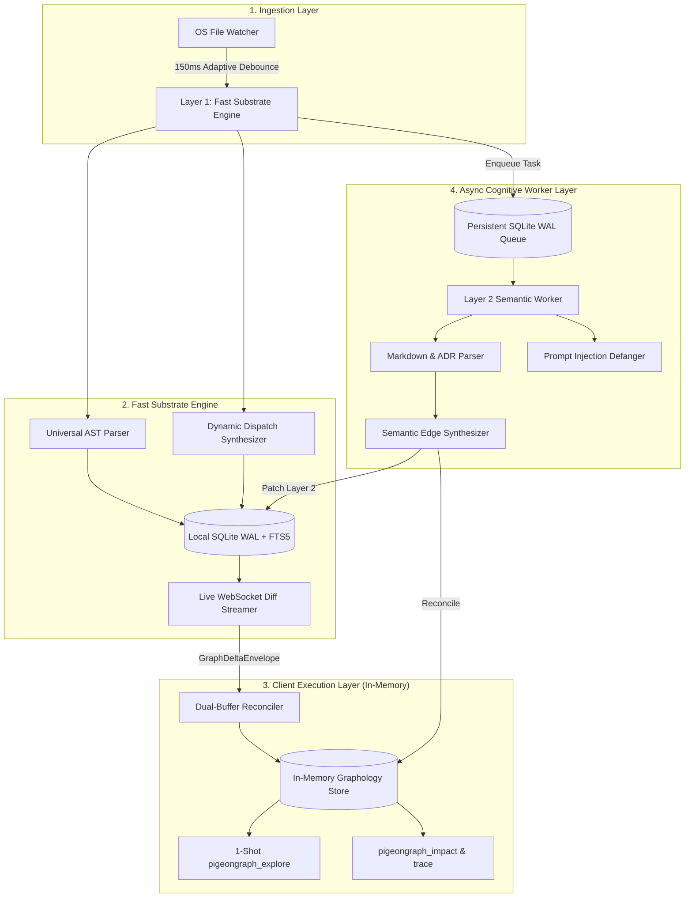

# 🐦 PigeonGraph

> **The Unified Multi-Layer Code Knowledge Graph for AI Coding Agents**  
> *Combines sub-second OS filesystem monitoring, dynamic dispatch synthesis, and asynchronous multimodal document intelligence into a zero-server architecture.*

[](LICENSE)
[](https://github.com/Hoppy-Beast/pigeongraph/actions)
[](https://nodejs.org)
[](https://modelcontextprotocol.io)

**Author & Creator:** [MD. Mahinur Rahman Prachurza (Hoppy-Beast)](https://github.com/Hoppy-Beast)

---

## 🚀 Why PigeonGraph?

When AI coding agents (Claude, Antigravity, Cursor, Gemini) work on large codebases, they waste **over 60% of their context window and time** blindly crawling files with `grep` and `find`.

Existing code graph systems embody fatal architectural compromises:
* **CodeGraph**: Blazing fast sub-second AST updates, but code-only (completely blind to architecture RFCs, ADRs, design specs, and media).
* **Graphify**: Broad multimodal document ingestion, but relies on static batch runs and lacks real-time sub-second OS file sync.
* **GitNexus**: Deep execution flows, but restricted by **non-commercial licensing (PolyForm 1.0)** and overwhelms LLMs with 17 granular tools.

**PigeonGraph synthesizes the best of all three while engineering away their flaws:**
1. **Sub-100ms Live Sync**: Native OS kernel watcher (`FSEvents` / `ReadDirectoryChangesW` / `inotify`) with adaptive debouncing (150ms–1500ms).
2. **Dynamic Dispatch Synthesis**: Resolves EventEmitters (`.emit` -> `.on`), Web framework routes (`GET /orders`), and React `setState` re-renders.
3. **Multimodal Knowledge Ingestion**: Connects code symbols directly to Markdown RFCs, Architecture Decision Records (ADRs), and `#WHY` design rationale tags.
4. **Triple-Hash Invariant State Machine**: Prevents race conditions between fast AST edits (<15ms) and slow background LLM document passes.
5. **1-Shot Agent MCP Paradigm**: AI agents get definitions, call hierarchies, dynamic dispatches, blast radius, and source spans in **1 single turn**.
6. **100% Permissive MIT License**: Freely forkable and usable in enterprise and commercial environments with standard attribution.

---

## 📊 Comparative Feature Matrix

| Feature / Capability | CodeGraph | Graphify | GitNexus | **PigeonGraph (Our Engine)** |
| :--- | :---: | :---: | :---: | :---: |
| **Licensing** | MIT (Permissive) | Apache 2.0 / MIT | **PolyForm Noncommercial (Commercial Ban)** | **MIT License (Permissive)** |
| **Index Freshness** | Native OS Watcher (100–2000ms) | Batch / Git Hooks (Manual) | Batch CLI (`gitnexus analyze`) | **Native OS Watcher + Adaptive Debounce** |
| **Multi-Modal Non-Code Docs (PDFs, ADRs, Specs)** | ❌ (Code only) | ✅ (PDFs, Whisper, Docs) | ❌ (Code & Markdown only) | ✅ (Markdown, RFCs, ADRs, Invariants) |
| **Dynamic Dispatch (EventEmitters, Routes, React)** | ✅ (Best-in-class) | ❌ (Raw name matching) | ⚠️ (MRO/DI only, misses events/React) | ✅ (EventEmitters + Routes + React + MRO) |
| **Execution Flow Tracing (`STEP_IN_PROCESS`)** | ❌ (On-the-fly search only) | ❌ (Clusters only) | ✅ (Scored entry-point BFS flows) | ✅ (Precomputed `STEP_IN_PROCESS` sequences) |
| **Agent MCP Experience** | ✅ **1-Tool Paradigm** (`explore`) | 7 MCP Tools | ❌ **17 MCP Tools (Tool Overload)** | ✅ **Tiered: 1 Primary (`explore`) + Analytical Opt-in** |
| **Cross-Repo Contract Registry** | ❌ (Single repo only) | ⚠️ (Global graph merge) | ✅ (Repository Groups & Contracts) | ✅ (Cross-Repo Contract Linkages) |
| **Client Memory Architecture** | SQLite DB file | NetworkX (High RAM ceiling) | Local Node backend (Server dependent) | **In-Memory Graphology + Zero-Server Mode** |
| **Prompt Injection Protection** | ❌ (None) | ⚠️ (Basic tags) | ❌ (None) | ✅ (Defanged sentinels + `<untrusted_source>`) |
| **Race Condition Safety (AST vs. LLM)** | N/A (AST only) | ❌ (Overwrites on rebuild) | ❌ (Sequential batch only) | ✅ (Triple-Hash Invariant State Machine) |

---

## 🏗️ Architecture & Workflow



---

## 📦 Monorepo Packages

* **`@pigeongraph/schema`**: Draft 2020-12 formal JSON schema, invariant hash engines (`H_content`, `H_ast`, `H_semantic_inv`), and Lamport/Vector clocks.
* **`@pigeongraph/substrate`**: Sub-second AST parsing, EventEmitters, framework route synthesizers, and SQLite WAL engine.
* **`@pigeongraph/semantic`**: Priority-tiered persistent queue, prompt injection defanging sandbox, ADR parser, and semantic edge synthesizers.
* **`@pigeongraph/client`**: Hot in-memory Graphology engine, dual-buffer state reconciliation, and 1-shot exploration tools.
* **`@pigeongraph/mcp`**: Stdio JSON-RPC 2.0 Model Context Protocol server and CLI interface.

---

## ⚡ Quickstart

### 1. Installation

```bash
git clone https://github.com/Hoppy-Beast/pigeongraph.git
cd pigeongraph
npm install
npm run build
```

### 2. Run Tests

```bash
npm run test:all
```

### 3. CLI Exploration

```bash
# Query the codebase architecture directly from terminal
npx pigeongraph explore "verifyToken"
```

---

## 🔌 Connecting to AI Coding Agents (MCP Setup)

PigeonGraph natively implements the **Model Context Protocol (MCP)** over `stdio`.

### Google Antigravity
Add to your project's `.gemini/antigravity/mcp/pigeongraph.json` or MCP settings:

```json
{
  "mcpServers": {
    "pigeongraph": {
      "command": "node",
      "args": [
        "path/to/PigeonGraph/packages/pigeongraph-mcp/dist/cli.js",
        "serve-mcp"
      ]
    }
  }
}
```

### Claude Desktop / Claude Code
Add to `claude_desktop_config.json`:

```json
{
  "mcpServers": {
    "pigeongraph": {
      "command": "node",
      "args": ["path/to/PigeonGraph/packages/pigeongraph-mcp/dist/cli.js", "serve-mcp"]
    }
  }
}
```

### Cursor / Windsurf
Add to `.cursor/mcp.json`:

```json
{
  "mcpServers": {
    "pigeongraph": {
      "command": "node",
      "args": ["path/to/PigeonGraph/packages/pigeongraph-mcp/dist/cli.js", "serve-mcp"]
    }
  }
}
```

---

## 🛠️ MCP Tools Overview

### 1. `pigeongraph_explore` (Primary 1-Shot Tool)
Answers architectural queries in **1 single turn**, returning:
* **`symbols`**: Exact definitions, line ranges, signatures, and docstrings.
* **`execution_flows`**: Entry points (`HTTP_ROUTE`, `CLI_COMMAND`) and call chains.
* **`dynamic_dispatches`**: Synthesized EventEmitter channels, route handlers, and React state.
* **`blast_radius`**: Risk-weighted impact analysis (`LOW`, `MEDIUM`, `HIGH`, `CRITICAL`).
* **`served_spans`**: Deduplicated source code spans.

### 2. `pigeongraph_impact`
Calculates precise blast radius and risk severity scores across upstream/downstream callers.

### 3. `pigeongraph_trace`
Traces the shortest directed execution path between two symbols across modules and repositories.

---

## 📜 License

This project is licensed under the **MIT License** — see the [LICENSE](LICENSE) file for details.

**Copyright (c) 2026 MD. Mahinur Rahman Prachurza (Hoppy-Beast)**
