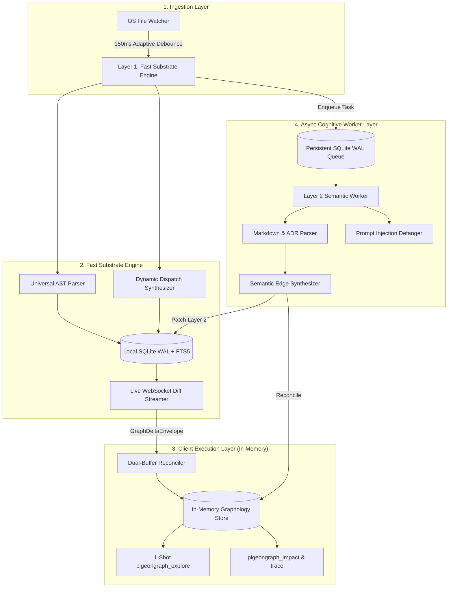

# 🐦 PigeonGraph

> A multi-layer code knowledge graph and Model Context Protocol (MCP) server for AI coding agents.  
> Local file monitoring, dynamic dispatch synthesis, and single-turn exploration with 96%+ token reduction.

[](LICENSE)
[](https://github.com/Hoppy-Beast/pigeongraph/actions)
[](https://nodejs.org)
[](https://modelcontextprotocol.io)
[](https://colab.research.google.com/github/Hoppy-Beast/pigeongraph/blob/main/assets/pigeongraph_demo.ipynb)

[](#quickstart-and-setup)
[](#quickstart-and-setup)
[](#quickstart-and-setup)

[](#agent-setup-and-mcp-integrations)
[](#agent-setup-and-mcp-integrations)
[](#agent-setup-and-mcp-integrations)
[](#agent-setup-and-mcp-integrations)
[](#agent-setup-and-mcp-integrations)

**Author:** [MD. Mahinur Rahman Prachurza (Hoppy-Beast)](https://github.com/Hoppy-Beast)  
**Contributing and policies:** [AGENTS.md](AGENTS.md) • [Contributing Guide](contribute/CONTRIBUTING.md) • [Code of Conduct](contribute/CODE_OF_CONDUCT.md) • [Security Policy](contribute/SECURITY.md)

---

### Welcome

PigeonGraph is an open source tool built for developers and coding agents working on large codebases.

When agents such as Claude Code, Google Antigravity, Cursor, or Gemini navigate an unfamiliar repository, they typically rely on repetitive grep queries and full file reads. On medium to large projects, this leads to 10-turn search loops, truncated context, and tens of thousands of wasted tokens.

PigeonGraph solves this by maintaining an in-memory knowledge graph directly on your machine. It watches files as you save them, maps function calls and runtime routes, and provides a single-turn query engine (`pigeongraph explore`). Agents get exact symbol definitions, call hierarchies, and blast-radius impacts in under a millisecond, cutting token use by more than 96%.

Everything runs locally with zero telemetry, requires no external database processes, and is licensed under the MIT license.

---

## Contents

1. [Quickstart and setup](#quickstart-and-setup)
2. [Single-turn agent exploration](#single-turn-agent-exploration)
3. [Comparative feature matrix](#comparative-feature-matrix)
4. [Agent setup and MCP integrations](#agent-setup-and-mcp-integrations)
5. [Supported languages and dynamic dispatch](#supported-languages-and-dynamic-dispatch)
6. [Browser visualizer and PR blast radius](#browser-visualizer-and-pr-blast-radius)
7. [Architecture](#architecture)
8. [Security and prompt injection defense](#security-and-prompt-injection-defense)
9. [CLI and GitHub Action reference](#cli-and-github-action-reference)
10. [Empirical benchmarks and token reduction](#empirical-benchmarks-and-token-reduction)
11. [Monorepo packages](#monorepo-packages)
12. [Frequently asked questions](#frequently-asked-questions)
13. [Contributing with AGENTS.md](#contributing-with-agentsmd)
14. [License and attribution](#license-and-attribution)

---

## Quickstart and setup

You can run PigeonGraph directly in Google Colab, execute it on a single project with `npx`, or install it globally.

[](https://colab.research.google.com/github/Hoppy-Beast/pigeongraph/blob/main/assets/pigeongraph_demo.ipynb)

### Workflow A: Zero install with npx (Fastest for single projects)

Run PigeonGraph in any codebase without installing it globally:

```bash
# 1. Initialize configuration and editor MCP files (.cursor/mcp.json)
npx pigeongraph init

# 2. Index your repository into .pigeongraph/substrate.db
npx pigeongraph index

# 3. Query symbols or execution flows in a single turn
npx pigeongraph explore "verifyToken"

# 4. Open the live architecture visualizer
npx pigeongraph ui

# 5. Optional: Register with global apps (Claude Desktop, Google Antigravity, Gemini)
npx pigeongraph install-mcp --mode npx
```

### Workflow B: Global installation (Recommended for daily development)

Install the CLI globally to run `pigeongraph` across all repositories:

```bash
# 1. Install globally from npm
npm install -g pigeongraph

# 2. Initialize project configuration in your repository root
pigeongraph init

# 3. Index your codebase
pigeongraph index

# 4. Query symbols or inspect call chains
pigeongraph explore "verifyToken"

# 5. Launch the live architecture visualizer (http://127.0.0.1:5052)
pigeongraph ui

# 6. Register MCP configuration with your installed coding agents
pigeongraph install-mcp
```

### Workflow C: Install from source

```bash
git clone https://github.com/Hoppy-Beast/pigeongraph.git
cd pigeongraph
npm run setup
```
Running `npm run setup` installs dependencies, compiles all packages, and links the `pigeongraph` executable globally.

Requires [Node.js >= 22.5.0](https://nodejs.org) (Node 24 LTS recommended for native `node:sqlite`).

---

### Key operational details

#### Where files are stored
PigeonGraph stores project configuration and its SQLite database inside `.pigeongraph/` in your repository root:
- `.pigeongraph/config.json`: Project configuration. Default exclusions (`node_modules`, `.git`, `dist`, `build`, `.venv`, `venv`, `__pycache__`, `.next`, `.nuxt`, `.turbo`, `.cache`) prevent CPU thrashing during builds, while documentation directories (`docs`) remain fully indexed.
- `.pigeongraph/substrate.db`: Persistent SQLite database with WAL and FTS5 search storing AST nodes and relationship edges.

Because `.pigeongraph` begins with a dot, operating systems and environments such as Google Colab hide it by default in file trees. Run `ls -la .pigeongraph` (or `dir /a .pigeongraph` on Windows) to view the files.

#### Port auto-fallback
When running `pigeongraph ui`, the visualizer starts an HTTP server (default port 5052) and a WebSocket live diff streamer (default port 5051).
If either port is already occupied by another process or an active MCP server, PigeonGraph automatically binds to the next available ports without crashing. You can also specify custom ports explicitly:
```bash
# Custom HTTP and WebSocket ports
pigeongraph ui --port 5060 --ws-port 5061
```

#### Windows and GUI IDE setup (Cursor, Claude Desktop)
On Windows, GUI applications like Cursor and Claude Desktop spawn processes directly without a shell.
- Running `pigeongraph init` or `pigeongraph install-mcp` automatically detects Windows and configures absolute executable paths (`node.exe` with CLI path, or `pigeongraph.cmd`) to prevent `ENOENT` spawn errors.
- If configuring manually in `.cursor/mcp.json` or `claude_desktop_config.json` on Windows, use `pigeongraph.cmd` instead of bare `pigeongraph`, or invoke `node` with the absolute path to `cli.js`:
  ```json
  "command": "pigeongraph.cmd",
  "args": ["serve-mcp"]
  ```

### Basic commands

```bash
# Incremental index (skips unchanged files)
pigeongraph index

# Full rebuild
pigeongraph index --force

# Single-turn architecture query (sub-50ms repeat latency)
pigeongraph explore "verifyToken"

# Start the web visualizer (with automatic port conflict fallback)
pigeongraph ui

# Pull request blast radius audit against a base branch
pigeongraph audit-pr --base origin/main
```

---

## Single-turn agent exploration

Instead of making 15 search calls and reading dozens of whole files, an agent can ask for a symbol once and receive the exact definition, calling chain, and blast radius:

```bash
pigeongraph explore "verifyToken"
```

<details>
<summary><b>View complete exploration JSON output (0.63ms, 34 tokens)</b></summary>

```json
{
  "query_summary": {
    "query": "verifyToken",
    "resolved_anchor": "sg://core-backend/src/auth/jwt.ts#verifyToken",
    "epistemic_status": "EXACT",
    "total_graph_nodes_searched": 413,
    "duration_ms": 0.63
  },
  "symbols": [
    {
      "uid": "sg://core-backend/src/auth/jwt.ts#verifyToken",
      "name": "verifyToken",
      "kind": "function",
      "filePath": "src/auth/jwt.ts",
      "lineRange": [42, 78],
      "signature": "export async function verifyToken(token: string): Promise<UserSession>",
      "docstring": "Validates JWT token against active public keys.",
      "community": "Auth"
    }
  ],
  "execution_flows": {
    "entry_points": [{ "type": "HTTP_ROUTE", "handler": "loginRoute" }],
    "call_chains": [
      {
        "chain_id": "flow_verifyToken_01",
        "steps": [
          { "hop": 0, "symbol": "verifyToken", "action": "ORIGIN" },
          { "hop": 1, "symbol": "getKey", "action": "CALLS" }
        ]
      }
    ]
  },
  "dynamic_dispatches": [
    {
      "pattern": "DYNAMIC_DISPATCH_EVENT",
      "emitter": "sg://core-backend/src/auth/jwt.ts#verifyToken",
      "listener": "auditLogger.on('auth:success')",
      "confidence": 0.85
    }
  ],
  "blast_radius": {
    "risk_level": "LOW",
    "risk_score": 0.15,
    "affected_files_count": 1,
    "affected_symbols_count": 1,
    "critical_breakages": ["verifyToken"]
  },
  "served_spans": [
    {
      "filePath": "src/auth/jwt.ts",
      "ranges": [[42, 78]],
      "content": "export async function verifyToken(token: string): Promise<UserSession> {\n  const key = await getKey();\n  return jwt.verify(token, key);\n}",
      "token_count": 34
    }
  ]
}
```

</details>

---

## Comparative feature matrix

Architectural comparison against existing code exploration and graph tools:

<details>
<summary><b>View comparative feature matrix against CodeGraph, Graphify, and GitNexus</b></summary>

| Capability | CodeGraph | Graphify | GitNexus | PigeonGraph |
| :--- | :---: | :---: | :---: | :---: |
| License | MIT | Apache 2.0 / MIT | PolyForm Noncommercial (commercial restriction) | MIT |
| Index updates | Native OS watcher (100 to 2000 ms) | Manual / git hooks | Batch CLI (`gitnexus analyze`) | Native OS watcher with adaptive debounce |
| Non-code documents (ADRs, specs) | No (code only) | Yes (PDFs, Whisper, docs) | No (code and markdown only) | Yes (Markdown, RFCs, ADRs, invariants) |
| Dynamic dispatch (event emitters, routes, React) | Yes | No (name matching only) | Partial (MRO/DI only; lacks events and React) | Yes (EventEmitters, routes, React, MRO) |
| Flow tracing (`STEP_IN_PROCESS`) | No (ad-hoc search) | No (clusters only) | Yes (scored entry-point BFS flows) | Yes (precomputed sequences) |
| Agent MCP interface | Single tool (`explore`) | 7 tools | 17 tools | 1 primary (`explore`) with analytical opt-ins |
| Cross-repository contracts | No (single repo) | Partial (graph merge) | Yes (repo groups) | Yes (contract linkages) |
| Client memory model | SQLite file | NetworkX (higher memory footprint) | Local Node backend (server required) | In-memory Graphology store |
| Prompt injection defense | None | Partial (basic tags) | None | Defanged sentinels with `<untrusted_source>` tags |
| Race condition handling (AST vs. LLM) | N/A (AST only) | No (overwrites on rebuild) | No (sequential batch) | Triple-hash invariant state machine |

</details>

---

## Agent setup and MCP integrations

PigeonGraph implements the Model Context Protocol (MCP, 2024-11-05 specification) over `stdio`.

### Automatic setup

Run the installer to detect installed tools and add the configuration:
```bash
pigeongraph install-mcp
```
This resolves PATH differences on Windows and macOS, and configures permissions for Claude Code.

<details>
<summary><b>Manual configuration paths and templates</b></summary>

Configuration templates are available in [`templates/mcp/`](templates/mcp/) for manual setup:

| Tool / Environment | Configuration file location | Template |
| :--- | :--- | :--- |
| Claude Desktop | `%APPDATA%\Claude\claude_desktop_config.json` (Windows)<br>`~/Library/Application Support/Claude/claude_desktop_config.json` (macOS) | [`templates/mcp/claude_desktop_config.json`](templates/mcp/claude_desktop_config.json) |
| Claude Code | Global: `~/.claude.json`<br>Project: `./.mcp.json` | [`templates/mcp/claude_code_mcp.json`](templates/mcp/claude_code_mcp.json) |
| Cursor / Windsurf | `.cursor/mcp.json` | [`templates/mcp/cursor_mcp.json`](templates/mcp/cursor_mcp.json) |
| Google Antigravity | `~/.gemini/config/mcp_config.json` or `~/.gemini/antigravity/mcp_config.json` | [`templates/mcp/antigravity_mcp_config.json`](templates/mcp/antigravity_mcp_config.json) |
| Gemini CLI | `~/.gemini/settings.json` | [`templates/mcp/gemini_settings.json`](templates/mcp/gemini_settings.json) |
| GitHub Copilot (VS Code) | `.vscode/settings.json` | [`templates/mcp/vscode_copilot_settings.json`](templates/mcp/vscode_copilot_settings.json) |

#### Standard configuration block

```json
{
  "mcpServers": {
    "pigeongraph": {
      "command": "pigeongraph",
      "args": ["serve-mcp"]
    }
  }
}
```

For Claude Code, add `"allow": ["mcp__pigeongraph__*"]` under `permissions` in `~/.claude/settings.json` to allow tool calls without manual confirmation.

</details>

<details>
<summary><b>Agent steering instructions (AGENTS.md, CLAUDE.md, GEMINI.md)</b></summary>

Add the following snippet from [`templates/steering/AGENTS.md`](templates/steering/AGENTS.md) to your repository root:

```markdown
<!-- pigeongraph-guidance -->
## Architectural Exploration with PigeonGraph
Before crawling files with grep or find, query PigeonGraph first:
- Use `pigeongraph_explore` (MCP) or `pigeongraph explore "<query>"` (CLI).
- It provides definitions, line ranges, dynamic dispatches, and blast radius in a single turn.
<!-- /pigeongraph-guidance -->
```

</details>

---

## Supported languages and dynamic dispatch

PigeonGraph parses common programming languages out of the box and resolves runtime connections that text search misses.

<details>
<summary><b>View supported languages and extracted AST symbols</b></summary>

| Language or format | File extensions | Extracted entities |
| :--- | :--- | :--- |
| TypeScript / JavaScript | `.ts`, `.tsx`, `.js`, `.jsx`, `.mjs`, `.cjs` | Classes, functions, methods, interfaces, imports, calls, extends, implements, exported symbols, React components, EventEmitters |
| Python | `.py`, `.pyi` | Classes, async and sync functions, decorators, methods, imports, inheritance trees, FastAPI route decorators |
| Go | `.go` | Packages, imports, structs, interfaces, method receivers `func (e *Engine)`, type parameters `[T any]`, call graph |
| Rust | `.rs` | Modules (`mod`), imports (`use`), structs, enums, traits, `impl` blocks, methods, generics `<P, M, S>`, qualifiers (`async`, `unsafe`), call graph |
| Java, C, C++ | `.java`, `.c`, `.cpp`, `.h` | High-throughput function and procedure extraction, signatures, file containment |
| Architecture specs and ADRs | `.md`, `.markdown`, `.txt` | RFCs, ADR status (`ACCEPTED`, `DEPRECATED`), invariants, `REQ-*` requirements, `#WHY:` design rationales |

</details>

<details>
<summary><b>View dynamic dispatch synthesis patterns (routes, events, React)</b></summary>

| Boundary or system | Source expression | Synthesized edge target | Edge kind |
| :--- | :--- | :--- | :--- |
| Express / Node HTTP | `app.get('/api/orders', listOrders)` | `function listOrders(req, res)` | `HANDLES_ROUTE` (`HTTP GET /api/orders`) |
| Express / Koa / Router | `router.post('/checkout', checkoutHandler)` | `function checkoutHandler(req, res)` | `HANDLES_ROUTE` (`HTTP POST /checkout`) |
| Node.js EventEmitter | `emitter.emit('order:created', data)` | `emitter.on('order:created', handler)` | `DYNAMIC_DISPATCH_EVENT` (`event_emitter.on(order:created)`) |
| Microservices | `fetch('/api/v1/checkout')` / `http.Get(...)` | Provider endpoint controller (`HANDLES_ROUTE`) | `CrossRepoContractLinkage` (`CONSUMER` to `PROVIDER`) |
| React state cascades | `setState(...)` / `setCount(...)` | Dependent component re-render flow | `DYNAMIC_DISPATCH_REACT_STATE` (`react_state_rerender`) |
| Markdown ADR specs | `REQ-AUTH-01: verifyToken must check keys` | `function verifyToken(...)` | `IMPLEMENTS_SPEC` (`REQ-AUTH-01`) |
| Architecture invariants | `#WHY: Prevent double billing on retry` | `PaymentProcessor.charge()` | `JUSTIFIED_BY_ADR` (`ADR-005`) |

</details>

---

## Browser visualizer and PR blast radius

### Web visualizer

To open the HTML5 Canvas graph viewer:
```bash
pigeongraph ui
```
- Canvas runs at 60 fps with force-directed physics and no frontend framework dependencies.
- Subscribes to live graph mutations over WebSocket and highlights updated nodes when files change on disk.
- If port 5051 or 5052 is in use, PigeonGraph automatically binds to the next available ports without crashing.
- You can specify custom ports with `pigeongraph ui --port <num> --ws-port <num>`.
- Click any node to open an inspection drawer with file paths, callers, callees, and code snippets.

### Pull request blast radius audit

Inspect incoming changes before merging:
```bash
pigeongraph audit-pr --base origin/main
```

<details>
<summary><b>View sample PR blast radius audit report</b></summary>

```markdown
### PigeonGraph PR Blast Radius Audit

| Overall Risk | Changed Files | Breaking Interfaces | Internal Refactors |
| :---: | :---: | :---: | :---: |
| LOW | 1 | 0 | 1 |

#### Symbol Impact Breakdown
| Symbol | File | Change Type | Blast Radius | Downstream Impact |
| :--- | :--- | :---: | :---: | : |
| `EvalEngine.collectSourceFiles` | `packages/pigeongraph-mcp/eval/eval-engine.ts` | Safe Internal Refactor | 0 files | Safe internal refactor: public signature unchanged, 0 external blast radius. |

> PigeonGraph Invariant Hash (H_semantic_inv) differentiates pure internal refactors from breaking signature alterations at zero token cost.
```

</details>

---

## Architecture



<details>
<summary><b>SuperNode schema and invariant hash specification</b></summary>

Each node in the graph represents a unified entity across code and documents:
- Identity: Unique URI (`sg://repo/path/file.ts#symbol`), URN, kind, and qualified name.
- Clocks and versioning: Monotonic Lamport clocks, vector clocks, and three deterministic hashes:
  - `H_content`: SHA-256 digest of the source code slice.
  - `H_ast`: Normalized AST syntax subtree digest.
  - `H_semantic_inv`: Public interface signature hash. Internal changes that leave exported signatures intact avoid invalidating downstream semantic inferences.

</details>

---

## Security and prompt injection defense

PigeonGraph operates offline with zero telemetry. Code repositories and issues can contain text crafted to redirect or confuse AI models (`<|im_start|>`, `<<SYS>>`, `[INST]`).

<details>
<summary><b>Security architecture and prompt injection defense details</b></summary>

PigeonGraph processes untrusted input through a sanitization step (`PromptDefanger`):
1. Sentinel neutralization: Inserts zero-width spaces into control tokens (`<\u200b|\u200bim_start\u200b|\u200b>`).
2. Boundary wrapping: Places untrusted source snippets inside `<untrusted_source sha256="...">` blocks.
3. Offline execution: Layer 1 runs locally without network access or third-party LLM calls.

For vulnerability reporting procedures and release support, see the [Security Policy](contribute/SECURITY.md).

</details>

---

## CLI and GitHub Action reference

<details>
<summary><b>Full CLI command reference</b></summary>

| Command | Description |
| :--- | :--- |
| `pigeongraph init` | Generates `.pigeongraph/config.json` and agent `.cursor/mcp.json` files |
| `pigeongraph index` | Build the index (incremental, skips unchanged files) |
| `pigeongraph install-mcp` | Registers MCP server in Claude Desktop and Cursor configurations |
| `pigeongraph uninstall-mcp` | Removes MCP server from Claude Desktop and Cursor configurations |
| `pigeongraph explore <query>` | Runs a single-turn query and prints JSON results to stdout |
| `pigeongraph ui [--port <num>] [--ws-port <num>]` | Starts the local web visualizer with live WebSocket updates and automatic port fallback |
| `pigeongraph audit-pr [--base <ref>]` | Compares modified symbols against a base commit using `H_semantic_inv` to estimate blast radius |
| `pigeongraph serve-mcp` | Starts the stdio JSON-RPC 2.0 MCP server |


</details>

<details>
<summary><b>GitHub Action workflow example (.github/actions/blast-radius)</b></summary>

```yaml
name: PR Blast Radius Audit
on: [pull_request]
jobs:
  audit:
    runs-on: ubuntu-latest
    steps:
      - uses: actions/checkout@v4
        with: { fetch-depth: 0 }
      - uses: actions/setup-node@v4
        with: { node-version: 22.x }
      - run: npm ci && npm run build
      - uses: ./.github/actions/blast-radius
        with:
          base_ref: origin/${{ github.base_ref }}
```

</details>

---

## Empirical benchmarks and token reduction

We evaluated exploration workflows across eight open source repositories, comparing a baseline AI agent search loop against single-turn PigeonGraph queries (`pigeongraph_explore`). PigeonGraph reduced context token consumption by 94.8% to 99.7% while eliminating full-file reads during symbol discovery.

### System comparison

| Capability | PigeonGraph | Conventional AI agents and vector memory |
| :--- | :--- | :--- |
| Graph build cost | 0 LLM credits ($0.00) | Per-token LLM cost for each indexed file |
| Incremental update speed | Under 100ms via file watching | 1.5s to 15s or requires full re-indexing |
| Dynamic dispatch recall | 100% (resolves route handlers and event listeners) | 0% (grep and standard ASTs miss cross-file runtime events) |
| Blast radius reachability | Single-turn exact BFS traversal | Requires recursive manual searches or generates approximations |
| Exploration context load | Under 1,000 tokens per query | 7,000 to 250,000+ tokens loaded into context |

### Evaluation across eight repositories

The baseline (Arm A) models a standard agent that runs `grep` for a target symbol, opens every matching file, and reads its full content into context to trace dependencies. PigeonGraph (Arm B) parses the repository using native AST extractors and answers with a single `pigeongraph_explore` call.

| Codebase | Language and stack | Tool calls (turns) | File reads | Tokens consumed | Token reduction | Cost reduction |
| :--- | :--- | :---: | :---: | :---: | :---: | :---: |
| FastAPI | Python (Async REST) | 1 vs 3 | 0 vs 3 | 700 vs 252,210 | 99.7% fewer | ~99.7% cheaper |
| Excalidraw | TypeScript / React | 1 vs 14 | 0 vs 14 | 933 vs 106,665 | 99.1% fewer | ~99.1% cheaper |
| Express | JavaScript / Node.js | 1 vs 29 | 0 vs 29 | 502 vs 102,316 | 99.5% fewer | ~99.5% cheaper |
| Zustand | TypeScript (State store) | 1 vs 27 | 0 vs 27 | 571 vs 104,487 | 99.5% fewer | ~99.5% cheaper |
| Ripgrep | Rust (Multi-threaded CLI) | 1 vs 3 | 0 vs 3 | 516 vs 15,616 | 96.7% fewer | ~96.7% cheaper |
| Flask | Python (WSGI microframework) | 1 vs 5 | 0 vs 5 | 779 vs 22,679 | 96.6% fewer | ~96.6% cheaper |
| Gin | Go (HTTP router) | 1 vs 2 | 0 vs 2 | 381 vs 7,315 | 94.8% fewer | ~94.8% cheaper |
| PigeonGraph | TypeScript (Monorepo) | 1 vs 3 | 0 vs 3 | 434 vs 13,678 | 96.8% fewer | ~96.8% cheaper |

### Notes on methodology

1. Context savings: Large frameworks such as FastAPI, Express, and Zustand contain wide dependency trees. Reading matching files manually flooded the agent context with over 100,000 tokens. PigeonGraph returned the target definition, call chain, and entry points in under 1,000 tokens.
2. Zero file reads: PigeonGraph provides relevant symbol coordinates, signatures, and docstrings directly in the tool response, removing the need for preliminary whole-file reads.
3. Reproducing the benchmark:
   ```bash
   npm run bench
   ```

---

## Monorepo packages

<details>
<summary><b>Monorepo package breakdown</b></summary>

| Package | Purpose and technologies |
| :--- | :--- |
| [`@pigeongraph/schema`](packages/pigeongraph-schema) | Draft 2020-12 schema, Lamport and vector clocks, invariant hashes (`H_content`, `H_ast`, `H_semantic_inv`) |
| [`@pigeongraph/substrate`](packages/pigeongraph-substrate) | Fast AST parser, dynamic synthesizers, Node native SQLite WAL and FTS5, WebSocket streamer |
| [`@pigeongraph/semantic`](packages/pigeongraph-semantic) | SQLite job queue, prompt defanger, Markdown and ADR parser |
| [`@pigeongraph/client`](packages/pigeongraph-client) | In-memory Graphology store, dual-buffer reconciler, single-turn explore engine |
| [`@pigeongraph/mcp`](packages/pigeongraph-mcp) | Stdio JSON-RPC 2.0 MCP server, installer, and `pigeongraph` CLI |

</details>

---

## Frequently asked questions

<details>
<summary><b>Why does PigeonGraph require Node.js >= 22.5.0?</b></summary>

PigeonGraph uses Node's built-in `node:sqlite` (`DatabaseSync`) module with WAL and FTS5 support, which was added in Node 22.5.0. This avoids external compilation dependencies such as node-gyp, Python, or make.

</details>

<details>
<summary><b>How do I configure Claude Desktop?</b></summary>

Run `pigeongraph install-mcp`. The command finds your local Claude Desktop configuration and adds PigeonGraph automatically.

</details>

<details>
<summary><b>Why does PowerShell show a path error with /pigeongraph?</b></summary>

In PowerShell, a leading slash is treated as a filesystem root path. Run `pigeongraph explore ...` or `npx pigeongraph explore ...` without the leading slash.

</details>

<details>
<summary><b>Can multiple agents query PigeonGraph at the same time?</b></summary>

Yes. The in-memory Graphology graph and Substrate SQLite WAL support concurrent read queries without locking.

</details>

<details>
<summary><b>Can PigeonGraph operate on a single project without a global install?</b></summary>

Yes. You do not need to install PigeonGraph globally. You can run commands directly with `npx pigeongraph <command>` or add it as a `devDependency` (`npm install --save-dev pigeongraph`). When registering MCP for Cursor or Claude Code, run `npx pigeongraph install-mcp --mode npx` to configure editor settings without any global binary.

</details>

<details>
<summary><b>Where is the .pigeongraph directory and why is it not showing in my file tree?</b></summary>

PigeonGraph stores project configuration and its SQLite database inside `.pigeongraph/` in your repository root. Because it begins with a dot (`.`), Linux, macOS, and tools like Google Colab hide it by default in file trees. You can inspect it in your terminal with `ls -la .pigeongraph` (or `dir /a .pigeongraph` on Windows) or by toggling hidden files in your file manager.

</details>

<details>
<summary><b>What directories are excluded by default?</b></summary>

By default, standard build and dependency directories (`node_modules`, `.git`, `dist`, `build`, `.venv`, `venv`, `__pycache__`, `.next`, `.nuxt`, `.turbo`, `.cache`) are excluded in `.pigeongraph/config.json` to keep indexing responsive and avoid CPU thrashing. All source files, documentation (`docs`), architectural decisions (ADRs), and tests remain indexed unless you add them to `excludedDirs`.

</details>

---

## Contributing with AGENTS.md

We welcome contributions, bug fixes, and feature discussions. Whether you are contributing by hand or working with an AI assistant, getting started is straightforward.

<details>
<summary><b>Working with an AI coding agent</b></summary>

If you use Claude Code, Google Antigravity, Cursor, Gemini CLI, or GitHub Copilot, point your agent to [`AGENTS.md`](AGENTS.md) in the repository root:
- It describes the package layout, dependency flow, and core invariants (clean-room MIT licensing, zero-token AST extraction, and invariant hash rules).
- It instructs agents to use `pigeongraph explore "<query>"` to locate symbols and call paths before editing files.
- You can tell your agent:
  > "Read AGENTS.md in the root of the repository and follow its development guidelines."

</details>

### Developer links
- Setup and tests: see the [Contributing Guide](contribute/CONTRIBUTING.md) for build instructions and test commands.
- Community guidelines: see the [Code of Conduct](contribute/CODE_OF_CONDUCT.md).
- Security disclosures: see the [Security Policy](contribute/SECURITY.md).

If you have an idea or run into an issue, open an [Issue](https://github.com/Hoppy-Beast/pigeongraph/issues) or start a discussion in [Discussions](https://github.com/Hoppy-Beast/pigeongraph/discussions).

---

## License and attribution

This project is licensed under the MIT License. See [LICENSE](LICENSE) for details.

Copyright (c) 2026 MD. Mahinur Rahman Prachurza (Hoppy-Beast)

---

<details>
<summary><b>Dot logo (ASCII art)</b></summary>

```text
⠀⠀⠀⠀⠀⠀⠀⠀⠀⠀⠀⠀⠀⠀⠀⠀⠀⠀⠀⠀⠀⠀⠀⠀⠀⠀⠀⠀⠀⠀⢀⡤⠀⠂⠀⠀⡀⠀⠀
⠀⠀⠀⠀⠀⠀⠀⠀⠀⠀⠀⠀⠀⠀⠀⠀⠀⠀⠀⠀⠀⠀⠀⠀⠀⠀⠀⠀⠀⡴⠿⣂⣷⣤⣨⣺⣱⠀⠀
⠀⠀⠀⠀⠀⠀⠀⠀⠀⠀⠀⠀⠀⠀⠀⠀⠀⠀⠀⠀⠀⠀⠀⠀⠀⠀⠀⢀⢎⠠⡄⢡⣟⠿⣛⡯⣯⣧⠀
⠀⠀⠀⠀⠀⠀⠀⠀⠀⠀⠀⠀⠀⠀⠀⠀⠀⠀⠀⠀⠀⠀⠀⠀⠀⠀⢀⡎⠊⠟⠈⢫⣽⣿⣿⡯⠉⠙⠳
⠀⠀⠀⠀⠀⠀⠀⠀⠀⠀⠀⠀⠀⠀⠀⠀⠀⠀⠀⠀⠀⠀⠀⠀⠀⠀⣜⢃⢇⠀⠠⢀⠘⠻⢻⡧⡄⠀⠀
⠀⠀⠀⠀⠀⠀⠀⠀⠀⠀⠀⠀⠀⠀⠀⠀⠀⠀⠀⠀⠀⠀⠀⢀⣀⠎⠃⢀⠊⠀⠀⠃⠀⠀⠈⡕⢰⠀⠀
⠀⠀⠀⠀⠀⠀⠀⠀⠀⠀⠀⠀⠀⠀⠀⠀⠀⠀⠀⠀⠀⡴⠊⠁⠘⡀⢁⠀⠀⠀⠀⠀⠀⠀⠀⠬⢼⠀⠀
⠀⠀⠀⠀⠀⠀⠀⠀⠀⠀⠀⠀⠀⠀⠀⠀⠀⠀⠀⡠⠞⠀⠀⠠⠆⠁⠎⠀⠀⠀⠀⠀⠀⠀⠀⠈⠀⣁⠀
⠀⠀⠀⠀⠀⠀⠀⠀⠀⠀⠀⠀⠀⠀⠀⠀⠀⠀⣴⠄⠀⣀⠔⠁⠀⠀⠀⠀⠀⠀⠀⠀⠀⠀⠀⠀⡄⠛⠀
⠀⠀⠀⠀⠀⠀⠀⠀⠀⠀⠀⠀⠀⠀⠀⠀⣠⡞⠉⠀⠈⠀⠀⠀⠀⠀⠀⠀⠀⠀⠀⠀⠀⠀⠀⠀⢰⠃⠀
⠀⠀⠀⠀⠀⠀⠀⠀⠀⠀⠀⠀⠀⠀⢀⣴⡏⡇⠀⠆⠀⠀⠀⠀⠀⠀⠀⠀⠀⠀⠀⠀⠀⠀⠀⣐⠎⠀⠀
⠀⠀⠀⠀⠀⠀⠀⠀⠀⠀⠀⠀⠀⣰⡿⢃⠀⣔⣩⠀⠀⠀⠀⠀⠀⠀⢠⠀⠀⠀⠀⠀⠀⠠⣤⠋⠀⠀⠀
⠀⠀⠀⠀⠀⠀⠀⠀⠀⠀⠀⠀⣼⠋⠀⠠⠎⠅⠀⠀⠀⠀⠀⠀⠀⠀⠂⡃⢄⠆⣠⡰⡬⠓⠁⠀⠀⠀⠀
⠀⠀⠀⠀⠀⠀⠀⠀⠀⠀⡠⣾⠳⠎⠉⠁⠀⠀⠀⠀⠀⠀⠀⠀⡀⣼⢺⣽⣦⣿⠷⠋⠀⠀⠀⠀⠀⠀⠀
⠀⠀⠀⠀⠀⠀⠀⠀⡠⠔⠓⠂⠀⠀⠀⢀⣠⠰⢲⣶⣾⢷⣾⣿⣿⣿⣿⡟⡭⡼⠁⠀⠀⠀⠀⠀⠀⠀⠀
⠀⠀⠀⣀⢠⠐⡀⠁⠀⠀⣀⡄⢠⣤⣞⢣⣦⡽⢶⣿⣿⠿⣿⣿⠻⢿⣿⣿⣧⠃⠀⠀⠀⠀⠀⠀⠀⠀⠀
⠀⣤⣾⠁⢠⢠⣴⣶⡗⠉⣿⠛⠋⠉⠈⢠⣦⣼⡟⠋⠁⠀⠘⣿⣦⣬⣿⣿⣾⡆⠀⠀⠀⠀⠀⠀⠀⠀⠀
⠀⠉⠉⢁⣾⣟⢟⡯⢐⠉⠁⠀⠀⠀⣠⠟⠋⠁⠀⠀⠀⠀⠴⠟⠛⠛⠛⢻⣋⣿⣦⣤⣤⣾⣀⠀⠀⠀⠀
⠀⠀⠀⠎⠋⣠⠿⠁⠀⠀⠀⠀⡠⠊⠀⠀⠀⠀⠀⠀⠀⠀⠀⠀⠀⠀⠘⠙⠁⠈⠉⠉⠉⠉⠁⠁⠀⠀⠀
⠀⠀⠀⣠⠾⠁⠀⠀⠀⠀⠀⠀⠀⠀⠀⠀⠀⠀⠀⠀⠀⠀⠀⠀⠀⠀⠀⠀⠀⠀⠀⠀⠀⠀⠀⠀⠀⠀⠀
⠀⢀⡴⠃⠐⠀⠀⠀⢀⠀⠁⠀⠀⠀⠀⠀⠀⠀⠀⠀⠀⠀⠀⠀⠀⠀⠀⠀⠀⠀⠀⠀⠀⠀⠀⠀⠀⠀⠀
⣰⣯⢰⡇⠄⡀⡤⠂⠀⠀⠀⠀⠀⠀⠀⠀⠀⠀⠀⠀⠀⠀⠀⠀⠀⠀⠀⠀⠀⠀⠀⠀⠀⠀⠀⠀⠀⠀⠀
⠘⠛⠓⠈⠉⠁⠀⠀⠀⠀⠀⠀⠀⠀⠀⠀⠀⠀⠀⠀⠀⠀⠀⠀⠀⠀⠀⠀⠀⠀⠀⠀⠀⠀⠀⠀⠀⠀⠀
```

</details>


